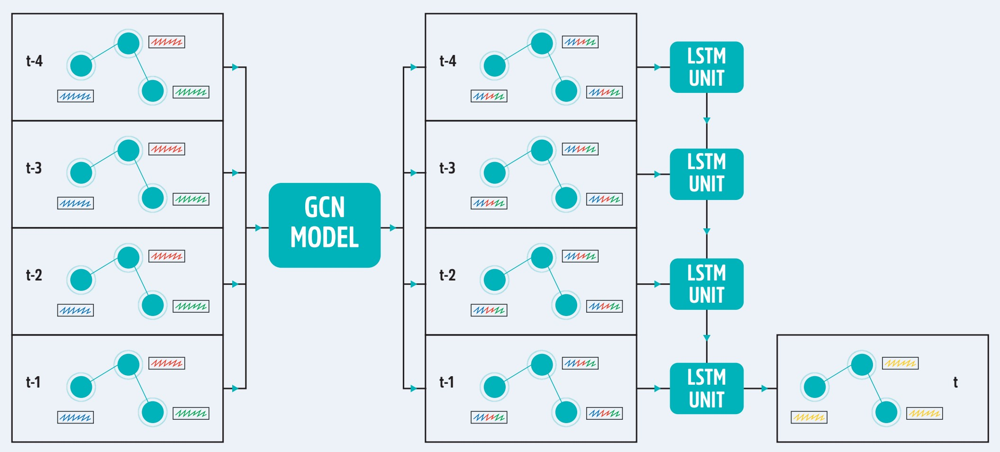
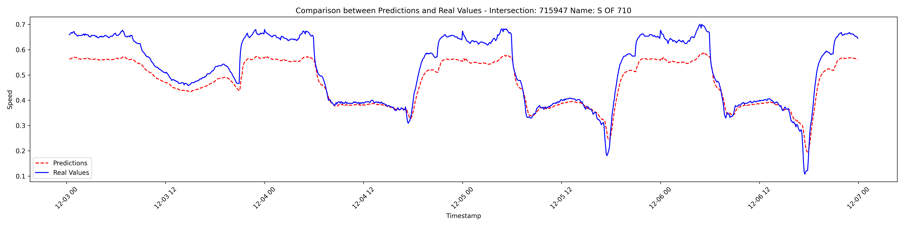
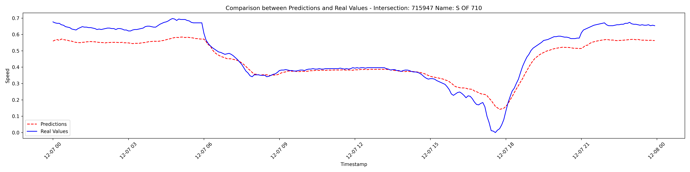
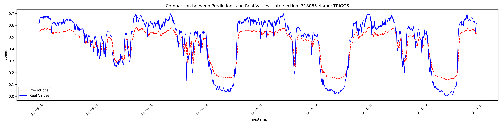
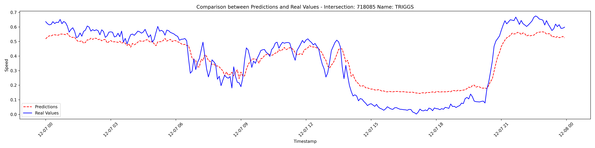
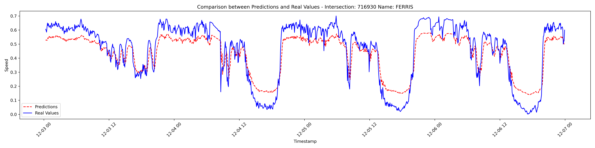
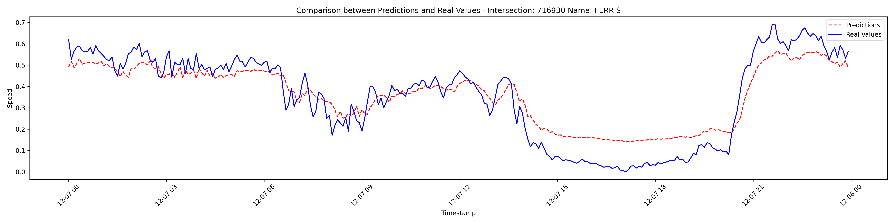

# Predicción de Velocidad Promedio en Intersecciones Urbanas con un Modelo Híbrido (GCN+LSTM)

## Objetivo
Desarrollar un modelo híbrido basado en redes neuronales (*GCN*+*LSTM*) para predecir la velocidad promedio en intersecciones urbanas, abordando dependencias espaciales y temporales del tráfico vehicular.

## Introducción
El tráfico urbano es una problemática creciente causada por la saturación vial, el aumento poblacional y las deficiencias en la infraestructura. Este proyecto propone un modelo para mejorar la gestión del tráfico mediante la integración de:
- **Dependencias espaciales**: Interacciones entre intersecciones viales.
- **Dependencias temporales**: Patrones históricos del tráfico. 

Además, el archivo `Poster Simposio.pdf ` presenta un resumen visual en formato de cartel para exponer con los aspectos clave del trabajo realizado. Este recurso complementa la comprensión del modelo y sus resultados.

## Metodología
El modelo se basa en dos componentes principales:

1. **Componente espacial (*GCN*)**:
   - Representa las relaciones entre intersecciones como un grafo.
   - Los nodos corresponden a intersecciones y las aristas a las carreteras que las conectan.

2. **Componente temporal (*LSTM*)**:
   - Captura patrones históricos utilizando datos secuenciales.

3. **Modelo combinado (*GCN*+*LSTM*)**:
   - Integra ambos componentes para predecir la velocidad promedio en cada intersección.
   - Utiliza una ventana temporal de cuatro pasos.
     

## Datos
Los datos utilizados provienen del **Departamento de Transporte de California** e incluyen:
- Velocidad promedio, flujo y ocupación vehicular.
- 30 intersecciones de la interestatal 5.
- Resolución temporal de cinco minutos.
- Una semana de datos (diciembre de 2023), divididos en:
  - **Entrenamiento**: 80%.
  - **Prueba**: 20%.

### Tabla de intersecciones analizadas
Esta tabla muestra los datos de las carreteras analizadas, incluyendo su identificación, nombre, latitud y longitud:

| **ID**  | **Name**                | **Lat**      | **Long**       |
|---------|-------------------------|--------------|----------------|
| 715947  | S OF 710               | 34.015325    | -118.17127     |
| 716930  | FERRIS                 | 34.013529    | -118.166192    |
| 718085  | TRIGGS                 | 34.011229    | -118.161247    |
| 716928  | ATLANTIC               | 34.007592    | -118.157266    |
| 718364  | GASPAR                 | 34.002455    | -118.151164    |
| 716924  | WASHINGTON 1           | 33.994935    | -118.14469     |
| 763980  | MALT                   | 33.992211    | -118.142079    |
| 716922  | GARFIELD               | 33.986224    | -118.136014    |
| 768523  | GREENWOOD              | 33.981723    | -118.130845    |
| 716920  | SLAUSON                | 33.97646     | -118.125953    |
| 715929  | GUATEMALA              | 33.971707    | -118.123095    |
| 716895  | PARAMOUNT              | 33.963867    | -118.11987     |
| 716918  | LAKEWOOD 2             | 33.958225    | -118.11239     |
| 716916  | LAKEWOOD 1             | 33.956897    | -118.110532    |
| 763990  | GARNISH                | 33.952949    | -118.105163    |
| 715920  | S OF 605               | 33.938544    | -118.094941    |
| 715916  | TINA                   | 33.924281    | -118.084952    |
| 716912  | PIONEER                | 33.920763    | -118.082501    |
| 716911  | IMPERIAL               | 33.916643    | -118.079557    |
| 716908  | SAN ANTONIO/NORWALK    | 33.911074    | -118.071686    |
| 759610  | SILVER BOW             | 33.907584    | -118.067796    |
| 716906  | FIRESTONE              | 33.903961    | -118.064046    |
| 716907  | ROSECRANS              | 33.900669    | -118.059422    |
| 763706  | FIDEL                  | 33.896666    | -118.052294    |
| 716902  | CARMENITA              | 33.892489    | -118.044573    |
| 763748  | SPRING                 | 33.89061     | -118.041088    |
| 716898  | VALLEY VIEW            | 33.882892    | -118.026822    |
| 716896  | PHOEBE                 | 33.879952    | -118.021355    |
| 762398  | OSMOND                 | 33.876316    | -118.014605    |
| 762347  | ARTESIA                | 33.875077    | -118.012367    |

## Resultados
- El modelo demuestra un buen desempeño al capturar patrones espaciales y temporales.
- Supera métodos tradicionales de predicción de tráfico.
- La eficacia depende de:
  - La calidad y cantidad de datos disponibles.
  - La capacidad computacional para manejar el modelo.

### Resultados específicos por intersección
- A continuación se muestran los resultados de 3 intersecciones:

 
 

 

## Instrucciones de Uso
Para reproducir este proyecto, sigue los pasos a continuación:

1. **Entorno de prueba**:
   - Este proyecto fue desarrollado y probado en **Google Colab**.

2. **Archivos de datos**:
   - Archivo original: `2000_sec_2023_12_listo.xls`.
   - Archivo filtrado: `los_speed (12).csv`.

3. **Pasos**:
   - Clona el repositorio
   - Sube ambos archivos a tu entorno de Google Colab.
   - Asegúrate de que las bibliotecas necesarias estén instaladas (por ejemplo, TensorFlow, PyTorch, pandas, numpy, etc.).
   - Ejecuta el código de procesamiento para preparar los datos.
   - Entrena el modelo híbrido (*GCN*+*LSTM*).
   - Evalúa los resultados utilizando los conjuntos de datos de prueba y entrenamiento.

4. **Ejecutar el modelo**:
   - El código fuente está disponible en [este repositorio de GitHub](https://github.com/tu_usuario/tu_repositorio).

### Limitaciones
- Escalabilidad para redes viales más grandes.
- Alto consumo computacional.

## Conclusiones
El enfoque híbrido *GCN*+*LSTM* es una herramienta prometedora para la predicción de tráfico:
- Integra dependencias espaciales y temporales de manera efectiva.
- Mejora significativamente la precisión frente a modelos tradicionales.

Los datos y el código fuente están disponibles en [este repositorio de GitHub](https://github.com/tu_usuario/tu_repositorio).

