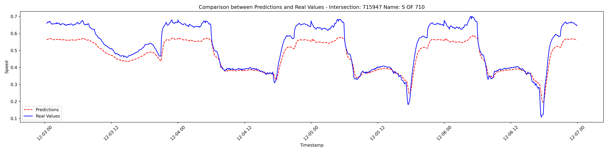
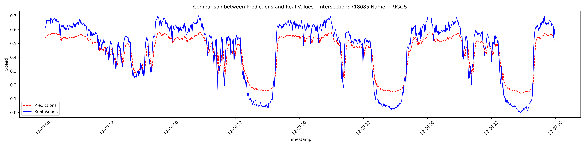
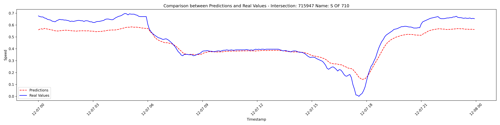
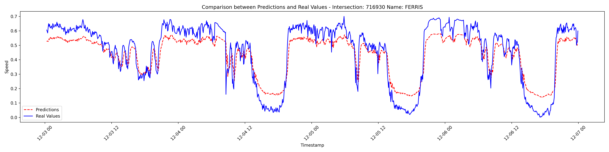
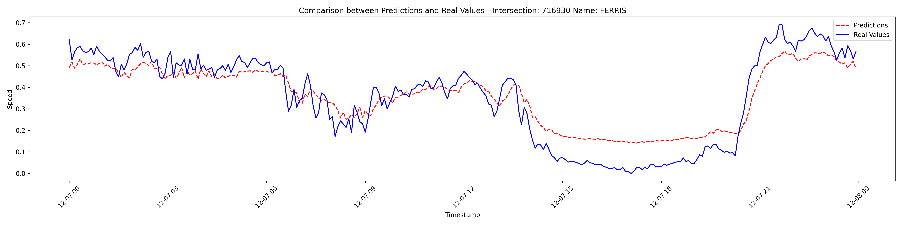

# Predicción de Velocidad Promedio en Intersecciones Urbanas con un Modelo Híbrido (GCN+LSTM)

## Objetivo
Desarrollar un modelo híbrido basado en redes neuronales (*GCN*+*LSTM*) para predecir la velocidad promedio en intersecciones urbanas, abordando dependencias espaciales y temporales del tráfico vehicular.

## Introducción
El tráfico urbano es una problemática creciente causada por la saturación vial, el aumento poblacional y las deficiencias en la infraestructura. Este proyecto propone un modelo para mejorar la gestión del tráfico mediante la integración de:
- **Dependencias espaciales**: Interacciones entre intersecciones viales.
- **Dependencias temporales**: Patrones históricos del tráfico.

## Metodología
El modelo se basa en dos componentes principales:

1. **Componente espacial (*GCN*)**:
   - Representa las relaciones entre intersecciones como un grafo.
   - Los nodos corresponden a intersecciones y las aristas a las carreteras que las conectan.

2. **Componente temporal (*LSTM*)**:
   - Captura patrones históricos utilizando datos secuenciales.

3. **Modelo combinado (*GCN*+*LSTM*)**:
   - Integra ambos componentes para predecir la velocidad promedio en cada intersección.
   - Utiliza una ventana temporal de cuatro pasos.

## Datos
Los datos utilizados provienen del **Departamento de Transporte de California** e incluyen:
- Velocidad promedio, flujo y ocupación vehicular.
- 28 intersecciones de la interestatal 5.
- Resolución temporal de cinco minutos.
- Una semana de datos (diciembre de 2023), divididos en:
  - **Entrenamiento**: 80%.
  - **Prueba**: 20%.
- La tabla de las intersecciones analizadas se muestra a cotninuación:

## Resultados
- El modelo demuestra un buen desempeño al capturar patrones espaciales y temporales.
- Supera métodos tradicionales de predicción de tráfico.
- La eficacia depende de:
  - La calidad y cantidad de datos disponibles.
  - La capacidad computacional para manejar el modelo.
- A continuación se muestran los resultados de 3 intersecciones

### Limitaciones
- Escalabilidad para redes viales más grandes.
- Alto consumo computacional.

## Conclusiones
El enfoque híbrido *GCN*+*LSTM* es una herramienta prometedora para la predicción de tráfico:
- Integra dependencias espaciales y temporales de manera efectiva.
- Mejora significativamente la precisión frente a modelos tradicionales.

Este trabajo incluye:
- Referencias a modelos previos.
- Discusión sobre parámetros clave.
- Visualización detallada de resultados.

Los datos y el código fuente están disponibles en un repositorio de GitHub para consulta adicional.
